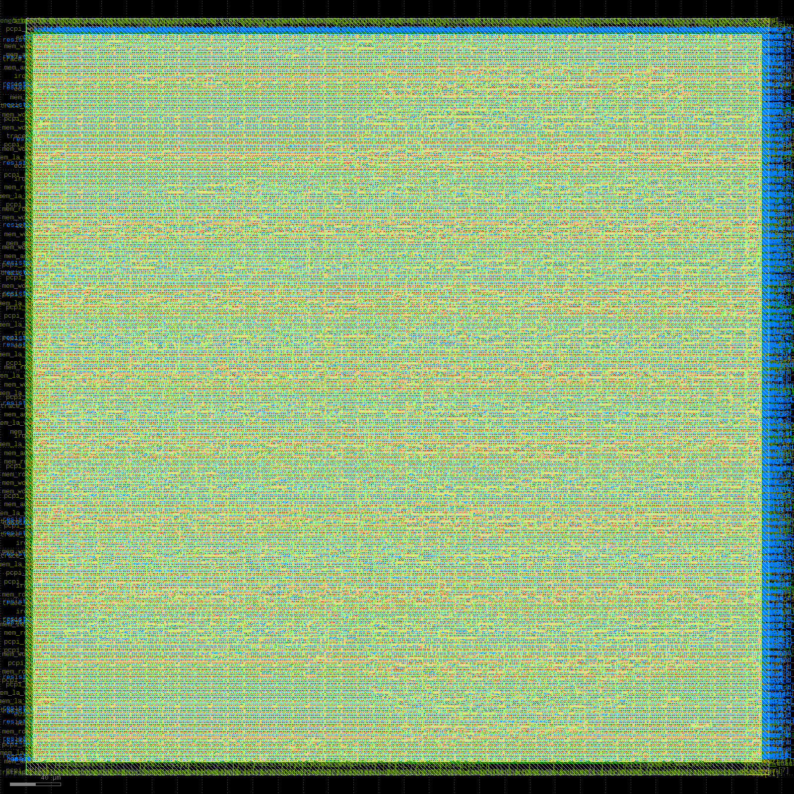
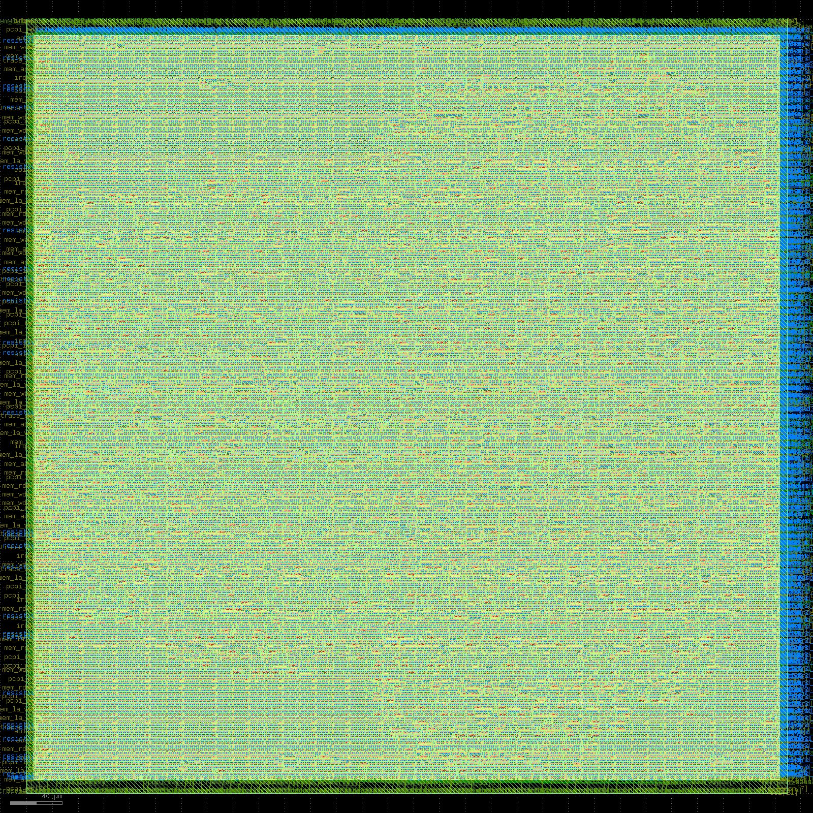

# PicoRV32 RISC-V Core — RTL-to-GDSII Physical Design (OpenLane / SKY130)

A complete ASIC physical design implementation of the open-source PicoRV32 RISC-V
CPU core, taken from RTL through to a manufacturable GDSII layout using the
open-source OpenLane flow and the SkyWater SKY130 process design kit — run twice,
at two different target clock frequencies, to explore real timing margin.

## Overview

| | |
|---|---|
| **Core** | [PicoRV32](https://github.com/YosysHQ/picorv32) — open-source RISC-V CPU |
| **Flow** | OpenLane (Yosys synthesis → OpenROAD PnR → Magic/KLayout signoff) |
| **PDK** | SkyWater SKY130 (130nm open-source PDK) |
| **Synthesis cell count** | 9,406 standard cells |
| **Die area** | 0.354 mm² |
| **Core utilization** | 30.8% |

## Two runs, two target frequencies

| | Run 1 (baseline) | Run 2 (pushed) |
|---|---|---|
| Target clock | 50 MHz (20ns period) | 100 MHz (10ns period) |
| Critical path | 1.65 ns | 8.02 ns |
| Setup violations (WNS/TNS) | 0 / 0 | 0 / 0 |
| Hold violations | 0 | 0 |
| Routing DRC violations | 0 | 0 |
| Runtime | ~14.5 min | ~15.3 min |

Both runs closed cleanly with **zero timing violations**. The critical path number
itself is the most interesting finding here — see "What I learned" below.

## Repository structure

```
├── src/
│   └── picorv32.v                  # PicoRV32 core RTL (from upstream)
├── config/
│   ├── config_50mhz.json           # OpenLane config, 50MHz target
│   └── config_100mhz.json          # OpenLane config, 100MHz target
├── layout/
│   ├── picorv32_layout_50mhz.png   # Final layout, 50MHz run
│   └── picorv32_layout_100mhz.png  # Final layout, 100MHz run
├── logs/
│   ├── metrics_50mhz.csv           # Full OpenLane metrics report, 50MHz run
│   └── metrics_100mhz.csv          # Full OpenLane metrics report, 100MHz run
└── README.md
```

## Flow stages completed (both runs)
- [x] RTL synthesis (Yosys) — 0 linter errors, 26 warnings (non-functional, e.g. unused signals)
- [x] Floorplanning, IO placement, tap/decap insertion, PDN generation
- [x] Global and detailed placement
- [x] Clock Tree Synthesis (CTS)
- [x] Global and detailed routing — 0 DRC violations
- [x] Multi-corner Static Timing Analysis (min/max/nominal)
- [x] GDSII streamout (Magic + KLayout, cross-checked with 0 XOR differences)
- [x] DRC, LVS, antenna rule checking, IR drop analysis

## Final layouts

### 50 MHz run


### 100 MHz run


The two layouts look nearly identical — same die area and utilization were used
for both runs (only `CLOCK_PERIOD` changed), which was deliberate, to isolate the
effect of the clock target on timing alone rather than also varying the floorplan.

## What I learned: the critical path number isn't fixed

The most useful thing this project taught me wasn't about PicoRV32 specifically —
it was about how OpenLane's optimizer behaves under different amounts of timing
pressure.

In the 50MHz run, the tool reported a critical path of just **1.65ns** — implying a
theoretical max frequency of over 600MHz. I initially assumed this was close to the
design's real ceiling. But when I doubled the target to 100MHz (10ns period), the
critical path reported came out to **8.02ns** — a very different number, even though
nothing about the RTL or floorplan changed.

The explanation: at a relaxed 20ns target, the placement/CTS/routing optimizers had
no pressure to work hard, so they settled for a "good enough" result that left a lot
of unused timing slack on the table. Once given a tighter 10ns target, those same
optimization passes worked harder and tightened the actual achievable path. The
8.02ns number is much closer to the design's genuine limit — meaning the real
theoretical ceiling is closer to ~125MHz, not the ~600MHz the first run's lazy
critical path number suggested.

This is a concrete lesson in not taking an EDA tool's first-pass number as a hard
fact without understanding what produced it.

## Challenges and how I solved them

**Generating a layout preview image without a GUI.** OpenLane didn't auto-generate
a PNG preview of the final layout, and setting up X11 forwarding for a full KLayout
GUI session inside WSL/Docker looked like a real time sink. I used KLayout's
headless batch mode (`klayout -zz -r script.py`) instead, with a short Python script
using KLayout's own `pya` API to load the GDS and export an image directly — no GUI
or display server needed. The first attempt failed with an API mismatch error
(`load_layout` expects a file path string directly, not a pre-constructed `Layout`
object); checking KLayout's actual documented API resolved it.

**Choosing a safe first target frequency.** Rather than guessing at an aggressive
clock target and risking a failed run on a design this much larger than a simple
counter, I deliberately started conservative — 50MHz, 30% core utilization,
area-optimized synthesis — to get a clean baseline first. That baseline confirmed
the environment and design were sound before pushing the clock target further.

## How to run

```bash
# Place picorv32.v under designs/picorv32/src/ in your OpenLane installation
# Copy config_50mhz.json or config_100mhz.json to designs/picorv32/config.json
cd OpenLane
make mount
./flow.tcl -design picorv32
```

## References
- PicoRV32: https://github.com/YosysHQ/picorv32
- OpenLane: https://github.com/The-OpenROAD-Project/OpenLane
- SKY130 PDK: https://github.com/google/skywater-pdk

## Author
Saurabh Manerikar — [LinkedIn](https://linkedin.com/in/saurabh-manerikar7b1815263)
